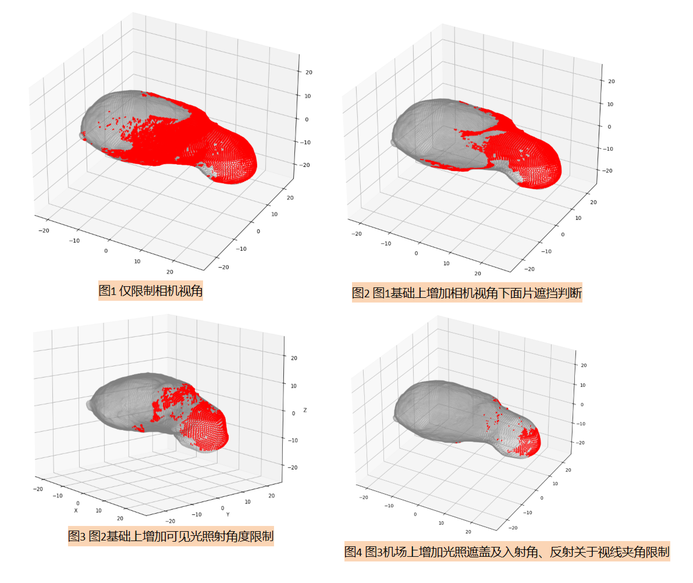

# 小行星探测覆盖性分析

author: gloomy

mail:mengtianyoo@gmail.com

github repo: [AstroViewSim](https://github.com/mengtianyoo/AstroViewSim)

## 流程大致是这样的：

1. **建立坐标系**

   - 原点：小行星 Bennu 的质心
   - x 轴：指向太阳 → 那么太阳光线入射方向可以设为 $\mathbf{s} = (-1, 0, 0)$（从太阳指向原点）
   - z 轴：Bennu 自转轴方向
   - y 轴：由右手系确定
2. **相机轨迹**

   - 相机在 z=0 的平面上，以 600 m 为半径绕原点旋转
   - 每隔 10° 计算一次相机位置：

     $\mathbf{c}(\theta) = 600 \bigl(\cos\theta,\;\sin\theta,\;0\bigr),\quad \theta=0°,10°,\dots,360°$
   - 相机光轴始终对准原点(后续添加视角摆动)
3. **可见性筛选条件**
   对于每个三角面片（质心 $\mathbf{p}$，法向量 $\mathbf{n}$）在每个相机位置 $\mathbf{c}$ 下，计算以下三个角度并与阈值比较：

   1. **入射角** $\alpha$：

      $\cos\alpha = \frac{\mathbf{n}\cdot\mathbf{s}}{\|\mathbf{n}\|\|\mathbf{s}\|}.$

      要求$⁡\alpha \le \alpha_{\max}$（光照角阈值）。
   2. **视角** $\beta$：
      视向向量 $\mathbf{v} = \frac{\mathbf{c}-\mathbf{p}}{\|\mathbf{c}-\mathbf{p}\|}$

      $\cos\beta = \frac{\mathbf{n}\cdot\mathbf{v}}{\|\mathbf{n}\|\|\mathbf{v}\|}.$

      要求 $\beta \le \beta_{\max}$（相机可视角阈值，和相机 FoV／2 对应）。
   3. **反射—视线夹角** $\gamma$：
      反射向量 $\mathbf{r} = 2(\mathbf{s}\cdot\mathbf{n})\,\mathbf{n} - \mathbf{s}$

      $ \cos\gamma = \frac{\mathbf{r}\cdot\mathbf{v}}{\|\mathbf{r}\|\|\mathbf{v}\|}.$

      要求 $⁡\gamma \le \gamma_{\max}$（反射—视线夹角阈值，用以模拟镜面反射强度）。
4. **实现思路**

   - 把上面公式写进一个循环：对每个 $\theta$、每个面片，计算 $\alpha,\beta,\gamma$，如果同时满足三条阈值，就标记为“可见”
   - 最终可以输出每张照片下可见面片的索引或质心坐标

---

## 代办事项：

- [X] 读取OBJ模型--> 面片做标集合、面片法向量结合（+可视化展示）
- [X] 判断相机可见区域输出集合（+可视化展示）
- [X] 增加相机视角遮挡判断（ray casting），判断相机视角下，面片互相遮盖情况（+可视化对比）
- [X] 计算面片反射太阳光的反射光线（保留入射光夹角、反射光夹角）
- [X] 增加光照遮挡关系判断（ray marching）
- [X] 计算与光轴夹角（保留反射光线与光轴夹角）
- [X] 可视化整体覆盖效果

---

## 对比效果

- 可视化



- 打印样例：

```txt
=== Visibility Analysis Summary ===
Total patches: 49152
Geometric visible: 3109 (6.3%)
Light illuminated: 2947 (94.8% of geometric)
Reflection conditions met: 1389 (44.7% of geometric)
Light unoccluded: 1389 (44.7% of geometric)
Final visible: 1389 (2.8% of total)

=== Detailed Visibility Information ===
Patch Index  | Incidence Angle  |  Viewing Angle  
-------------+------------------+-----------------
    7424     |      45.54       |      46.40  
    7435     |      47.63       |      48.66  
    7436     |      47.49       |      48.53  
    7552     |      31.57       |      32.33  
    7553     |      44.40       |      45.01   
--------------    ··········     -----------------
```
