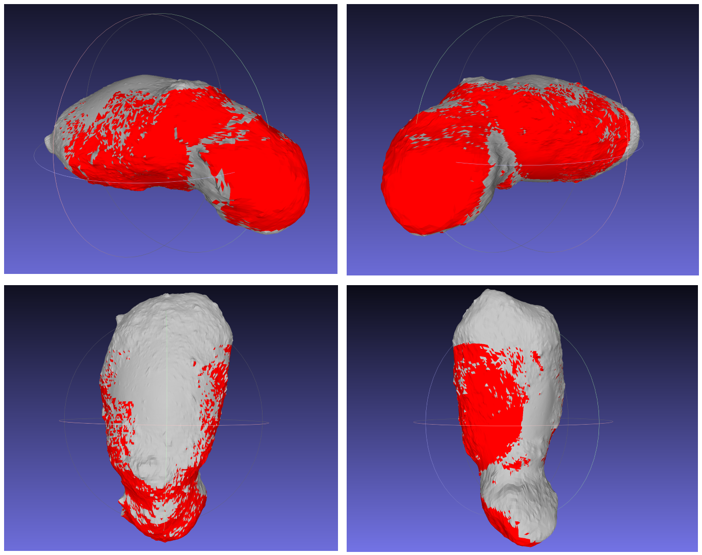

# 小行星探测覆盖性分析🔭

author: gloomy

mail:mengtianyoo@gmail.com

github repo: [AstroViewSim](https://github.com/mengtianyoo/AstroViewSim)

## 🧠算法流程：

1. **建立坐标系**

   - 原点：小行星 Bennu 的质心
   - x 轴：指向太阳 → 那么太阳光线入射方向可以设为 $\mathbf{s} = (-1, 0, 0)$（从太阳指向原点）
   - z 轴：Bennu 自转轴方向
   - y 轴：由右手系确定
2. **相机轨迹**

   - 相机在 z=0 的平面上，以 600 m 为半径绕原点旋转
   - 每隔 10° 计算一次相机位置：

     $\mathbf{c}(\theta) = 600 \bigl(\cos\theta,\;\sin\theta,\;0\bigr),\quad \theta=0°,10°,\dots,360°$
   - 相机光轴始终对准原点(后续添加视角摆动)
3. **可见性筛选条件**
   对于每个三角面片（质心 $\mathbf{p}$，法向量 $\mathbf{n}$）在每个相机位置 $\mathbf{c}$ 下，计算以下三个角度并与阈值比较：

   1. **入射角** $\alpha$：

      $\cos\alpha = \frac{\mathbf{n}\cdot\mathbf{s}}{\|\mathbf{n}\|\|\mathbf{s}\|}.$

      要求 $⁡\alpha \le \alpha_{\max}$（光照角阈值）。
   2. **视角** $\beta$：
      视向向量 $\mathbf{v} = \frac{\mathbf{c}-\mathbf{p}}{\|\mathbf{c}-\mathbf{p}\|}$

      $\cos\beta = \frac{\mathbf{n}\cdot\mathbf{v}}{\|\mathbf{n}\|\|\mathbf{v}\|}.$

      要求 $\beta \le \beta_{\max}$（相机可视角阈值，和相机 FoV／2 对应）。
   3. **反射—视线夹角** $\gamma$：
      反射向量 $\mathbf{r} = 2(\mathbf{s}\cdot\mathbf{n})\,\mathbf{n} - \mathbf{s}$

      $\cos\gamma = \frac{\mathbf{r}\cdot\mathbf{v}}{\|\mathbf{r}\|\|\mathbf{v}\|}.$

      要求 $⁡\gamma \le \gamma_{\max}$（反射—视线夹角阈值，用以模拟镜面反射强度）。
4. **实现思路**

   - 把上面公式写进一个循环：对每个 $\theta$、每个面片，计算 $\alpha,\beta,\gamma$，如果同时满足三条阈值，就标记为“可见”
   - 最终可以输出每张照片下可见面片的索引或质心坐标

---

## 📦代办事项：

- [X] 读取OBJ模型--> 面片做标集合、面片法向量结合（+可视化展示）
- [X] 判断相机可见区域输出集合（+可视化展示）
- [X] 增加相机视角遮挡判断（ray casting），**判断相机视角下，面片互相遮盖情况**（+可视化对比）
- [X] 计算面片反射太阳光的反射光线（保留入射光夹角、反射光夹角）
- [X] **增加光照遮挡关系判断**（ray marching）
- [X] 计算与光轴夹角（保留反射光线与光轴夹角）
- [X] 可视化整体覆盖效果
- [X] 增加是否运行中显示图像逻辑
- [X] 完善数据保存逻辑
- [X] 增加面积覆盖度计算
- [ ] 视角摆动，上下浮动15°（改变光轴）
- [ ] 小行星自传目前没有实现（需要考虑偏转、公转等轨道力学知识*精力不够*）
- [ ] 计算速度极慢，需要优化速度，初步考虑并行计算（没思路）
- [ ] 合并不同角度可见面片时的取舍问题（待解决）
- [X] 增加3D模型文件可视化（ply）

---

## ✅探测限制对比效果

- 可视化(单张)-Interactive 3D scatter plot of visible vs. invisible surface patches：


- 打印样例-Console summary of visibility statistics：

```txt
*********  visibility_analysis_angle_000.txt  **********
=== Visibility Analysis Summary ===
Total patches: 49152
Geometric visible: 3109 (6.3%)
Light illuminated: 2947 (94.8% of geometric)
Reflection conditions met: 2947 (94.8% of geometric)
Light unoccluded: 2947 (94.8% of geometric)
Final visible: 2947 (6.0% of total)
Visible area: 344.80 (9.5% of total area)

=== Detailed Visibility Information ===
Patch Index  | Incidence Angle  |  Viewing Angle  
-------------+------------------+-----------------
    7300     |      58.76       |      59.78  
    7424     |      45.54       |      46.40  
    7425     |      57.40       |      58.43  
    7427     |      58.15       |      59.06  
    7428     |      54.02       |      55.00  
    7429     |      52.56       |      53.52     
--------------    ··········     -----------------

*********  combined_stats.txt  **********
Total patches: 49152
Visible patches from all angles: 17359
Coverage percentage: 35.32%
Total area: 3637.13
Visible area: 1327.63
Area coverage percentage: 36.50%

```

- 合并所有角度后，3D模型可视化效果：

  

---

## 📊模型来源

- [itokawa](https://data.darts.isas.jaxa.jp/pub/hayabusa/shape/gaskell/) (需要转换为obj模型，推荐meshlab等)
- [Bennu](https://svs.gsfc.nasa.gov/vis/a000000/a005000/a005069/bennu_OLA_v21_PTM_very-high.obj)

---

## 📁 Dependencies

```bash
numpy
trimesh
matplotlib
----------------
pip install numpy trimesh matplotlib
```

---

## 🎄目录树

```bash
AstroViewSim/
│
├── dead_code/                  # 已废弃的单个模块代码💩
├── image/                      # 包含readme文件和一张小新星图片
├── requirements.txt            # 依赖列表
├── .gitignore                  # 排除obj大文件
│
├── main.py                     # 程序入口
│   ├── MeshProcessor.py        # 负责处理3D网格数据的加载和处理
│   ├── VisibilityStats.py      # 存储和展示可见性分析结果的数据类
│   ├── GeometricVisibility.py  # 几何可见性 + occlusion
│   ├── LightingAnalysis.py     # 光照判断 + 反射 + sun 遮挡
│   ├── VisibilityAnalyzer.py   # 整体可见性分析的主类
│   └── Visualizer.py           # 处理结果可视化
│
├── model/
│   ├── bennu.obj           # 贝努模型
│   └── itokawa.obj         # 丝川小行星模型
│
└── visibility_results/
    └── sun_angle_000/
        ├── combined_stats.txt                       # 整合覆盖情况分析（未整合面片具体角度，需要商量）
        ├── visibility_colored_meshr.ply             # 导出可交互的ply3D模型
        └── visibility_analysis_angle_000.txt        # 表示相机0°、太阳0°情况下的可见数据

```

## 📄 License

MIT License © [gloomy]
